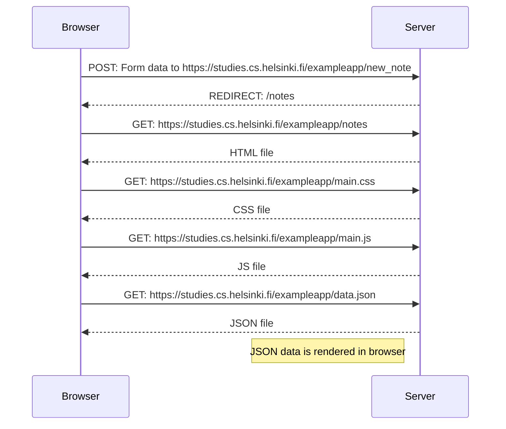
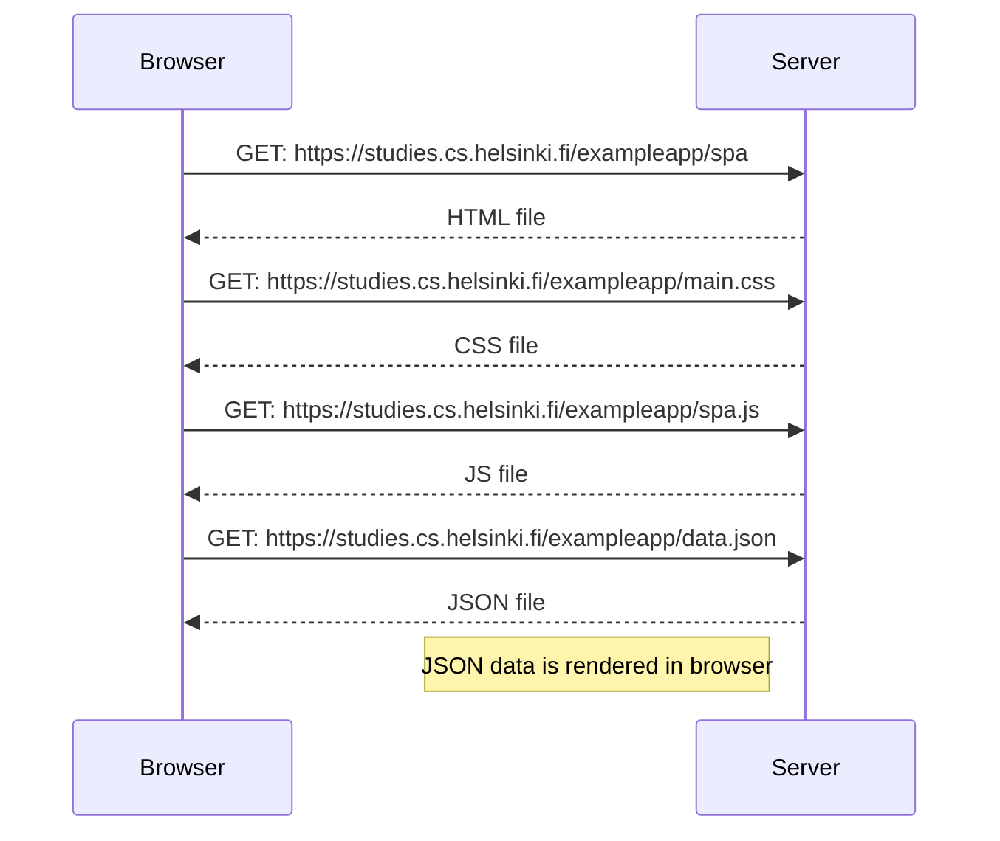
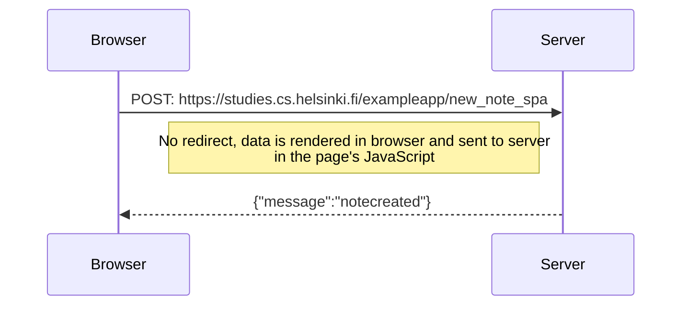

# fso-part0

Ex 0.4:

```mermaid
  sequenceDiagram
    Browser->>Server:POST: Form data to https://studies.cs.helsinki.fi/exampleapp/new_note
    Server-->>Browser:REDIRECT: /notes
    Browser->>Server:GET: https://studies.cs.helsinki.fi/exampleapp/notes
    Server-->>Browser:HTML file
    Browser->>Server:GET: https://studies.cs.helsinki.fi/exampleapp/main.css
    Server-->>Browser:CSS file
    Browser->>Server:GET: https://studies.cs.helsinki.fi/exampleapp/main.js
    Server-->>Browser:JS file
    Browser->>Server:GET: https://studies.cs.helsinki.fi/exampleapp/data.json
    Server-->>Browser:JSON file
    Note left of Server:JSON data is rendered in browser
```

Ex 0.5:

```mermaid
    sequenceDiagram
        Browser->>Server:GET: https://studies.cs.helsinki.fi/exampleapp/spa
        Server-->>Browser:HTML file
        Browser->>Server:GET: https://studies.cs.helsinki.fi/exampleapp/main.css
        Server-->>Browser:CSS file
        Browser->>Server:GET: https://studies.cs.helsinki.fi/exampleapp/spa.js
        Server-->>Browser:JS file
        Browser->>Server:GET: https://studies.cs.helsinki.fi/exampleapp/data.json
        Server-->>Browser:JSON file
        Note left of Server:JSON data is rendered in browser
```

Ex 0.6:

```mermaid
    sequenceDiagram
        Browser->>Server:POST: https://studies.cs.helsinki.fi/exampleapp/new_note_spa
        Note left of Server:No redirect, data is rendered in browser and sent to server <br/>in the page's JavaScript
        Server-->>Browser:{"message":"notecreated"}
```
